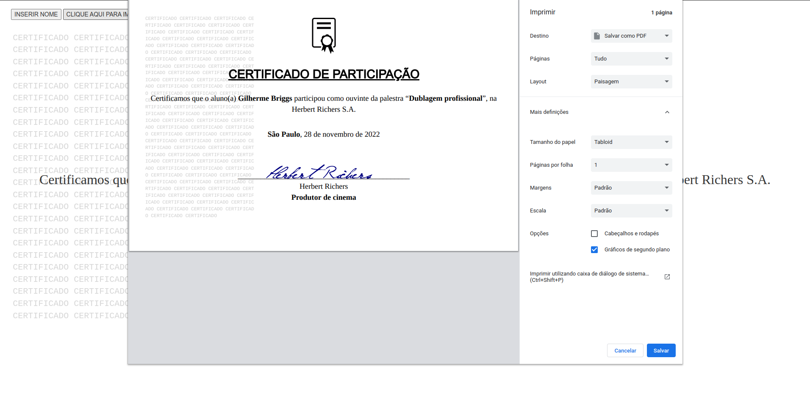

# Gerador de Certificado
Gerador de certificado em PDF  
[Demo](https://jeanrafaellourenco.github.io/gerador-certificado)
## Configurações de impressão

- Utilize o tamanho do papel **Tabloid** e o Layout como **Paisagem**.  

- O nome pode ser inserido pelo botão `INSERIR NOME` ou via parâmetro na url: [Guilherme Briggs](https://jeanrafaellourenco.github.io/gerador-certificado/?nome=Guilherme%20Briggs)

  
#
## Todo

- [ ] API de geração de certificado  
  - [ ] Implementar consulta e validação de certificado
- [ ] Melhorias no layout de impressão

### In Progress

- 

### Done ✓

- 
